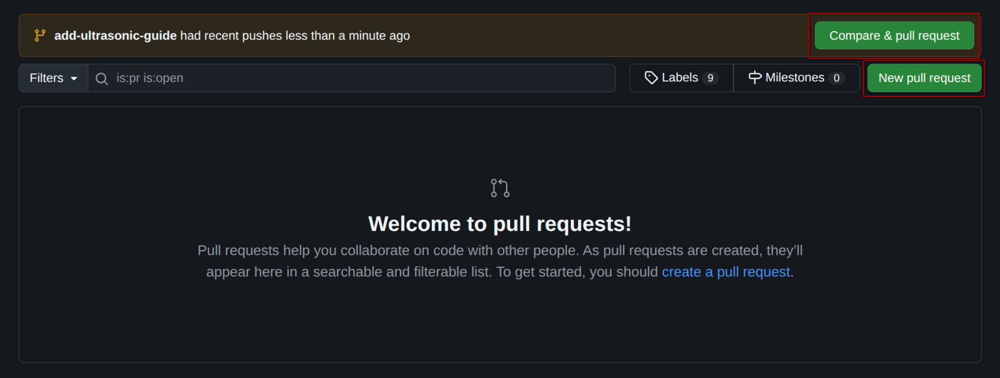
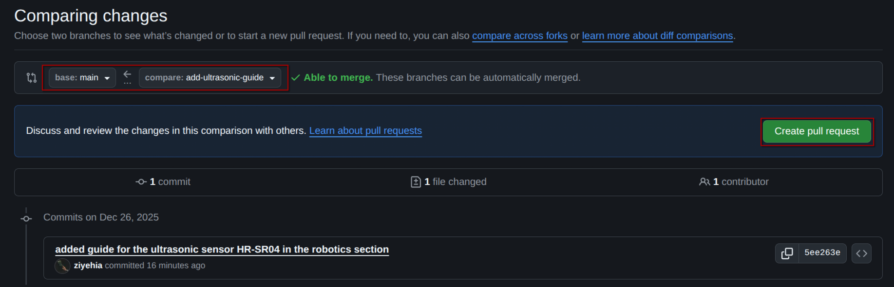
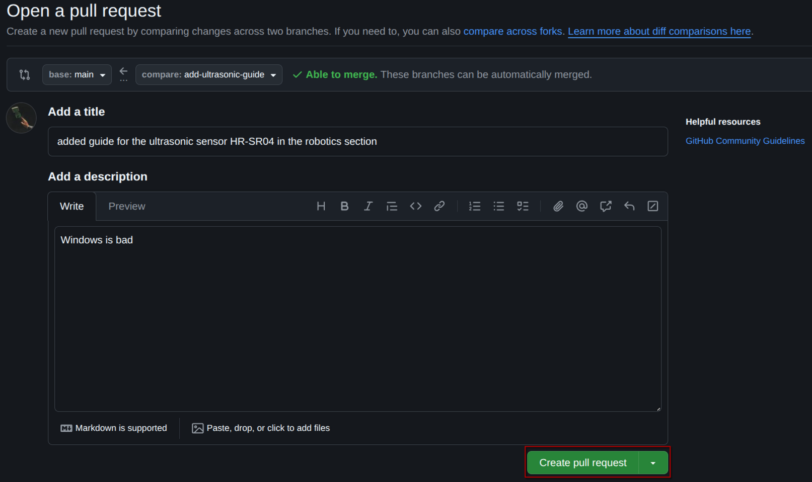
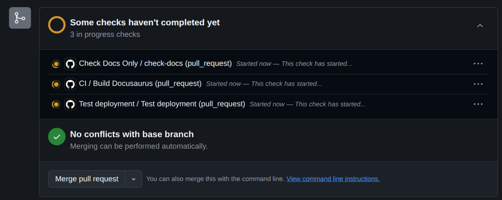
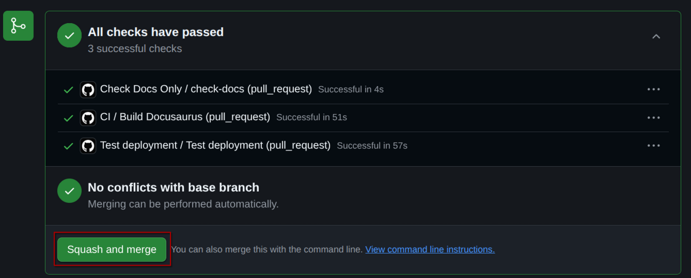

Link to the wiki: https://aresensea.github.io/AresHubWiki/

## How to contribute as a collaborator 

The wiki uses Markdown(`.md`) files. They are located at `docs/`, and if needed, images can be added to `docs/images`

To keep it simple, only admins are allowed to push directly into the main branch.  
Other contributors are allowed to add tutorials to the `docs` section only, through pull requests.  
If you have any suggestions for changes outside `docs`, contact an admin.  
Here is a step by step guide on how to do so.

First, make sure you're on the main branch, and up to date with it, if you're not up to date, then pull:
```bash
~/Documents/ENSEA/Ares/AresHubWiki main
🖎  git pull            
Enter passphrase for key '/home/yehiaz/.ssh/id_ed25519': 
Already up to date.
```

Then, switch to a new branch using the `switch` command with the `-c` argument in order to create the new branch:
```bash
~/Documents/ENSEA/Ares/AresHubWiki main
🖎  git switch -c add-ultrasonic-guide
Switched to a new branch 'add-ultrasonic-guide'
```
Now you can add Markdown (.md) files to any section in the `docs/` folder.  
After making the modification you needed to make, you can stage and commit the changes inside your new branch:
```bash
~/Documents/ENSEA/Ares/AresHubWiki add-ultrasonic-guide
🖎  git add .                         

~/Documents/ENSEA/Ares/AresHubWiki add-ultrasonic-guide*
🖎  git commit -m "added guide for the ultrasonic sensor HR-SR04 in the robotics section"                                  
[add-ultrasonic-guide 5ee263e] added guide for the ultrasonic sensor HR-SR04 in the robotics section
 1 file changed, 177 insertions(+)
 create mode 100644 docs/Tutorial Robo/ultrasonic.md
```
Now you can push to the remote Github repo, but in order to do that, you have to set the remote branch on Github as an upstream, just use the following command with the following arguments: 
```bash
~/Documents/ENSEA/Ares/AresHubWiki add-ultrasonic-guide
🖎  git push -u origin add-ultrasonic-guide
Enter passphrase for key '/home/yehiaz/.ssh/id_ed25519': 
Enumerating objects: 8, done.
Counting objects: 100% (8/8), done.
Delta compression using up to 16 threads
Compressing objects: 100% (5/5), done.
Writing objects: 100% (5/5), 4.31 KiB | 4.31 MiB/s, done.
Total 5 (delta 3), reused 1 (delta 0), pack-reused 0 (from 0)
remote: Resolving deltas: 100% (3/3), completed with 3 local objects.
remote: 
remote: Create a pull request for 'add-ultrasonic-guide' on GitHub by visiting:
remote:      https://github.com/AresEnsea/AresHubWiki/pull/new/add-ultrasonic-guide
remote: 
To github.com:AresEnsea/AresHubWiki.git
 * [new branch]      add-ultrasonic-guide -> add-ultrasonic-guide
branch 'add-ultrasonic-guide' set up to track 'origin/add-ultrasonic-guide'.
```

Now that your commit is pushed to Github, you should open a pull Request, so that the commit gets merged to the main branch.  
Go to the `Pull requests` section and start a new one: 


Make sure to compare your new branch to the main branch then create the pull request:


Add a title and a description:


Wait for the verification checks to finish (moment of peace):


When all the checks pass, you can squash and merge into the main branch!


If the checks do not pass, you can go into their details and try to solve the problem, recommit and rerun the checks.  
If you don't know how to solve them, seek help from a Github Master oh Padawan.

Refresh the wiki and see your fresh changes yeahhhyahhhh!


